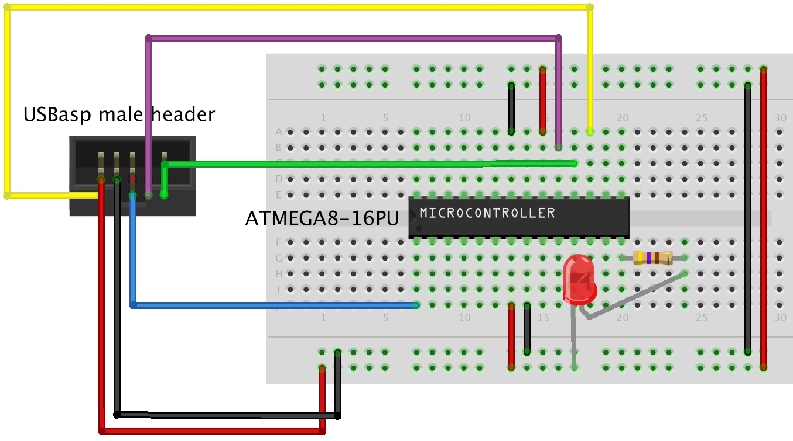
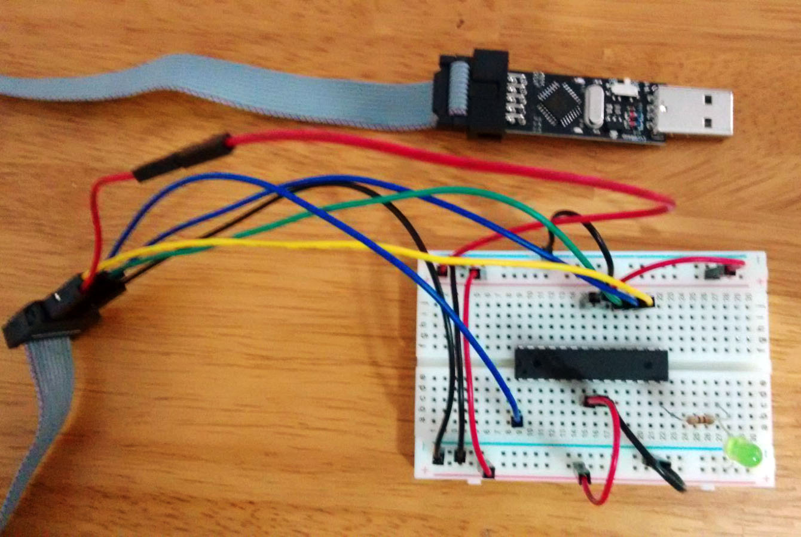
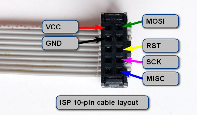
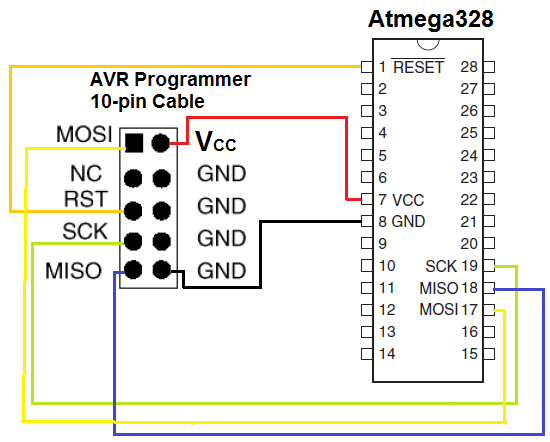

ATMEGA8-16PU
==================================================================
Programming ATMEGA8-16PU with USBasp using AVRdude on OSX. Using USBasp AVR programmer from betemcu.cn to flash HEX into atmel and using the same to power up the atmel so that LED can be blinked. USBasp has 10 header female FPC connector at the end and the pins are mirrored positions of the male header. The connection with USBasp is not needed to be removed while developing the firmware as it supplies the +5V power needed for the atmel. ATMEGA8 is a 8 bit microcontroller and 16PU denotes just the packaging.

Wiring
--------------------------------------
<p align="center">

</p>

<p align="center">

</p>

USBasp Pin Connection
--------------------------------------

<p align="center">

</p>

<p align="center">

</p>


Components / Software
--------------------------------------
- Atmel ATMEGA8-16PU
- 470 Ohm Resistor
- LED
- Jumper Wires
- USBasp AVR Programmer (Windows needs drivers installation)
- Breadboard
- AVRdude (Cross Compile Toolchain for AVR development)

Steps
--------------------------------------
- Compile the blink.c source code to .obj by executing (replace atmega8 with your atmel microcontroller)

```
	avr-gcc -mmcu=atmega8 -Wall -Os -o blink.elf blink.c
```
- Convert the .obj into Intel HEX by executing
```
	avr-objcopy -j .text -j .data -O ihex blink.elf blink.hex
```
- Connect the USBasp into usb port of the host computer and execute. (replace m8 with your atmel microcontroller. Execute "avrdude -c usbasp" list all the compatible microcontroller with USBasp )
```
	avrdude -c usbasp -p m8 -e -U flash:w:blink.hex
```
- Check [avrdude tutorial] (http://www.micahcarrick.com/tutorials/avr-microcontroller-tutorial/getting-started.html) for details about the commands

Debug
--------------------------------------
- Checking microcontroller USBasp connection by executing this outputs the below
	- avrdude -c usbasp -p m8
```
		avrdude: warning: cannot set sck period. please check for usbasp firmware update.
		avrdude: AVR device initialized and ready to accept instructions
		
		Reading | ################################################## | 100% 0.00s
		
		avrdude: Device signature = 0x1e9307
		
		avrdude: safemode: Fuses OK (H:FF, E:D9, L:E1)
		
		avrdude done.  Thank you.
```


- Successful Flashing outputs this
```
		avrdude: warning: cannot set sck period. please check for usbasp firmware update.
		avrdude: AVR device initialized and ready to accept instructions

		Reading | ################################################## | 100% 0.00s

		avrdude: Device signature = 0x1e9307
		avrdude: erasing chip
		avrdude: warning: cannot set sck period. please check for usbasp firmware update.
		avrdude: reading input file "blink.hex"
		avrdude: input file blink.hex auto detected as Intel Hex
		avrdude: writing flash (90 bytes):

		Writing | ################################################## | 100% 0.07s

		avrdude: 90 bytes of flash written
		avrdude: verifying flash memory against blink.hex:
		avrdude: load data flash data from input file blink.hex:
		avrdude: input file blink.hex auto detected as Intel Hex
		avrdude: input file blink.hex contains 90 bytes
		avrdude: reading on-chip flash data:

		Reading | ################################################## | 100% 0.04s

		avrdude: verifying ...
		avrdude: 90 bytes of flash verified

		avrdude: safemode: Fuses OK (H:FF, E:D9, L:E1)

		avrdude done.  Thank you.
```

Links
--------------------------------------
- http://hackaday.com/2010/10/23/avr-programming-introduction/
- http://www.micahcarrick.com/tutorials/avr-microcontroller-tutorial/getting-started.html
- https://www.youtube.com/watch?v=BPxgv2PXGw8
